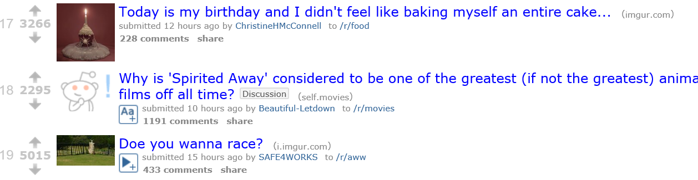

# Week-8-Lab

# Reddit

## Description
Build Reddit - bookmarks and voting in ASP.NET MVC/Web API using Forms, relationships, and a touch of JQuery

## Objectives

### Performance Objectives

After completing this assignment, you should be able to effectively

* Model Data
* Utilize AJAX to perform updates
* Publishing on Azure

## Details

### Deliverables

* A Pull Request of this repo that has :
  * ASP.NET MVC/Web API project
  * Database Migrations
* A link to a live azure instance

### Requirements

Reddit is "User-generated news links. Votes promote stories to the front
  page."
  
1. The default page of the website when started should show reddit posts.
  1. This page will look similiar to [this screenshot](assets/reddit.PNG)
  2. Each link will have an upvote and downvote link that utilizes AJAX to updated the upvote/downvote count for each post.
  3. A Posts rank is determined by (upvote - downvotes). The page will sort posts by this algorithm.
2. A page that allows users to create new reddit posts.
  1. This page will ask for a title, link to image (this is optional), and a description. 
  2. After creation they will be redirected back to the home page.

## Normal Mode
Normal mode is a simple implementation of Reddit as described in the requirements.

            
## Hard Mode

* Clicking a "Down" should create a negative vote
* Add a `User` class - this associates posts with a specific user
* When submitting a link, allow user to select themselves in a drop down
* Check the Links for unique URLs (i.e. don't allow double posting)

## Nightmare Mode
* Apply a more sophiscated algorithm for sorting posts besides just upvotes minus downvotes. [Check this for more details](https://medium.com/hacking-and-gonzo/how-reddit-ranking-algorithms-work-ef111e33d0d9#.bgxipztdq)

## Additional Resources

* Read [Getting Started with MVC](http://www.asp.net/mvc/overview/getting-started/introduction/getting-started)
* Read [Getting Started with EF6 and MVC 5](https://www.asp.net/mvc/overview/getting-started/getting-started-with-ef-using-mvc/creating-an-entity-framework-data-model-for-an-asp-net-mvc-application)
